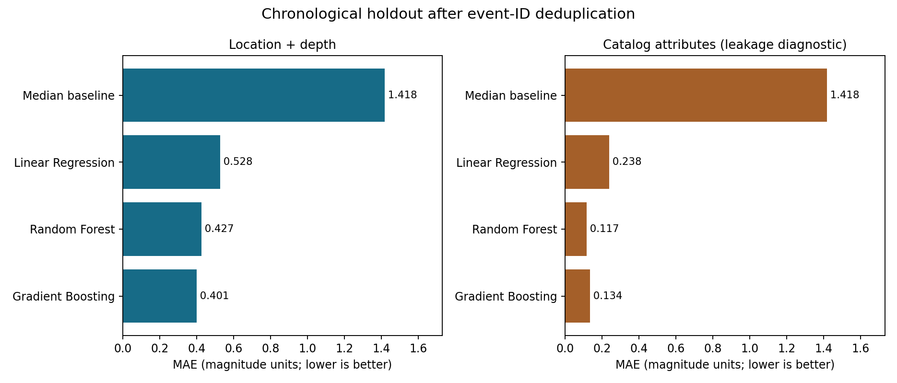

# Estimation de la magnitude des séismes

**Projet de machine learning : comparaison de modèles de régression, exploration de données sismiques et évaluation reproductible.**

[English](README.md) · [Notebook v2](notebooks/earthquake-analysis-v2.ipynb) · [Rapport](reports/project-report-fr.pdf)

**Statut : en développement.** Je poursuis la structuration, la documentation et l’évaluation de ce projet. Les [prochaines étapes](ROADMAP.md) distinguent les fonctionnalités disponibles des améliorations prévues.

**Recruteurs :** consultez la [fiche projet](docs/project-brief.md) ou [mon profil LinkedIn](https://www.linkedin.com/in/rachid-el-magroua/).

## Présentation

J'ai réalisé ce projet académique avec Anas DARRAZ, Ilyas MAJDOUBI et Nabil EL HILALI, sous l'encadrement d'Asmae BENTALB, pendant l'année 2024/2025.

L'objectif est d'estimer la magnitude à partir des caractéristiques d'événements enregistrés. Nous avons étudié la Régression Linéaire, Random Forest et Gradient Boosting, ainsi que la préparation des données et l'évaluation avec MAE et MSE.

Il s'agit d'une estimation rétrospective. Le projet ne prédit pas la date ou le lieu d'un prochain séisme et ne constitue pas un système d'alerte.

## Résultats de l'évaluation reproductible

Le dataset contient 1 137 lignes pour 602 identifiants d'événements uniques. Après déduplication, 481 événements servent à l'entraînement et 121 événements plus récents au test.

Avec la longitude, la latitude et la profondeur uniquement :

| Modèle | MAE | RMSE | R² |
| --- | ---: | ---: | ---: |
| Référence par médiane | 1,418 | 1,570 | -2,848 |
| Régression Linéaire | 0,528 | 0,659 | 0,323 |
| Random Forest | 0,427 | 0,536 | 0,552 |
| Gradient Boosting | 0,401 | 0,517 | 0,582 |



La seconde partie du graphique utilise des attributs de catalogue liés à la magnitude. Elle sert au diagnostic de fuite d'information et ne représente pas une preuve de capacité à anticiper les séismes.

## Exécution

Depuis la racine du dépôt, avec Python 3.12 et un environnement virtuel activé :

```bash
python -m pip install -r requirements.txt
python train.py --output results-local
python -m unittest discover -s tests -v
```

Le script enregistre les métriques, les prédictions, les versions utilisées et le graphique. Les cinq tests vérifient notamment la séparation des événements et l'apprentissage du prétraitement uniquement sur les données d'entraînement.

## Lecture du dépôt

Le notebook v2 conserve les expériences académiques avec imputation des alertes, écrêtage IQR et optimisation des hyperparamètres. Le notebook antérieur reste disponible pour référence. Le rapport documente le travail académique. Le script `train.py` ajoute une évaluation distincte, avec déduplication et séparation chronologique. Les [résultats détaillés](docs/results.md) expliquent ces différences.

L'analyse a identifié des événements répétés et des variables pouvant révéler la cible. La méthodologie actuelle réduit ces problèmes, mais la disponibilité des attributs au moment réel d'une prédiction reste à vérifier.

## Équipe

Rachid EL MAGROUA, Anas DARRAZ, Ilyas MAJDOUBI et Nabil EL HILALI.

Encadrement : Asmae BENTALB.
